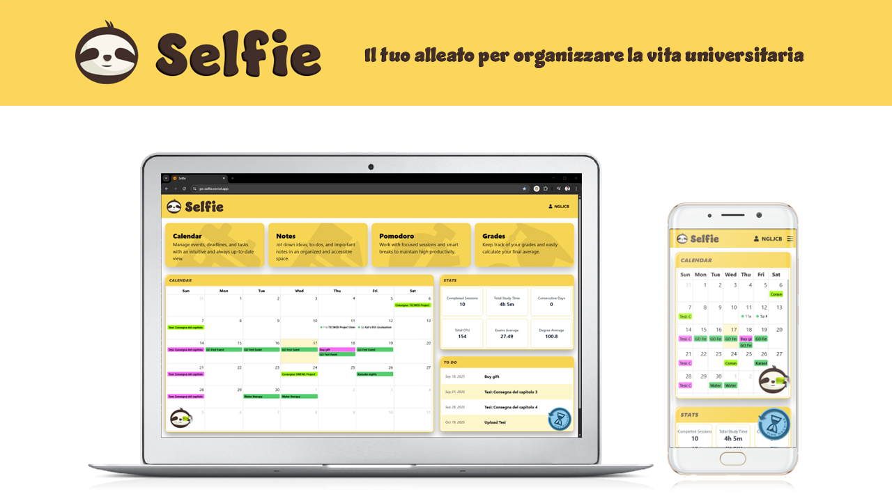

<a href="https://px-selfie.vercel.app"></a>

**Selfie** is a full-stack productivity web-app built with `Angular`, `ExpressJS`, `TailwindCSS`, & `Supabase`, designed to help students manage events, meet deadlines, & perform daily tasks efficiently across both desktop and mobile.

## Live Demo

<a href="https://px-selfie.vercel.app"></a>  
👉 Deployed on Vercel: [https://px-selfie.vercel.app](https://px-selfie.vercel.app)


## Project Structure

```bash
px-selfie
├── client                     # Frontend (Angular + TailwindCSS)
│   ├── public                 # Public assets (banner, demo GIF, etc.)
│   └── src
│       ├── app           
│       │   ├── components     # Angular components
│       │   ├── directives     # Custom directives
│       │   ├── model          # Interfaces & DTOs
│       │   ├── service        # Angular services
│       │   └── utils          # Utility functions
│       ├── environments       # Environment configs
│       ├── styles.scss        # Global SCSS styles
│       ├── tailwind.css       # Tailwind entrypoint
│       └── main.ts            # Angular bootstrap
│       
│
└── server                     # Backend (ExpressJS + Supabase)
    ├── controller             # API route controllers
    ├── middleware             # Middlewares (auth, logging, etc.)
    ├── model                  # Data models
    ├── persistence            # DB interaction layer
    ├── service                # Business logic services
    ├── router.js              # API route definitions
    └── server.js              # Express app entrypoint
```

## Backend Setup

Navigate to the backend folder, to go `server` folder:

```bash
cd server
```

Install dependencies:
```bash
npm install
```

Run the server in development mode:
```bash
npm run dev
```

By default, the backend runs at: http://localhost:3000. The application will automatically respond whenever a valid request has been made.


## Frontend

To start a local development server for the frontend, select `client` folder:

```bash
cd client
```

Install dependencies:
```bash
npm install
```

Build the project: 
```bash
ng build
```

Run the Angular dev server:
```bash
ng serve
```

By default, the frontend runs at: http://localhost:4200. The app will automatically reload whenever you modify the source files.

## Deployment & Repository

This project is deployed in vercel at https://px-selfie.vercel.app

The repository is available <a href="https://github.com/ngljcb/px-selfie">here</a> for browsing all the project resources.